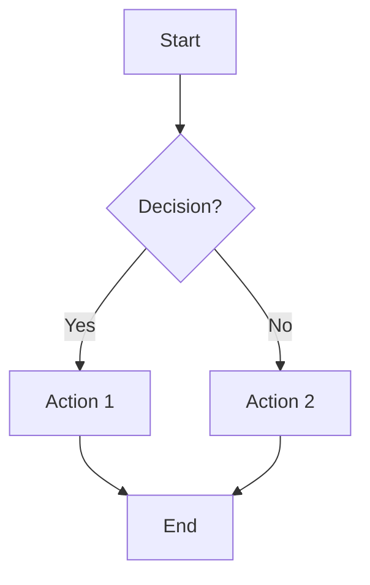
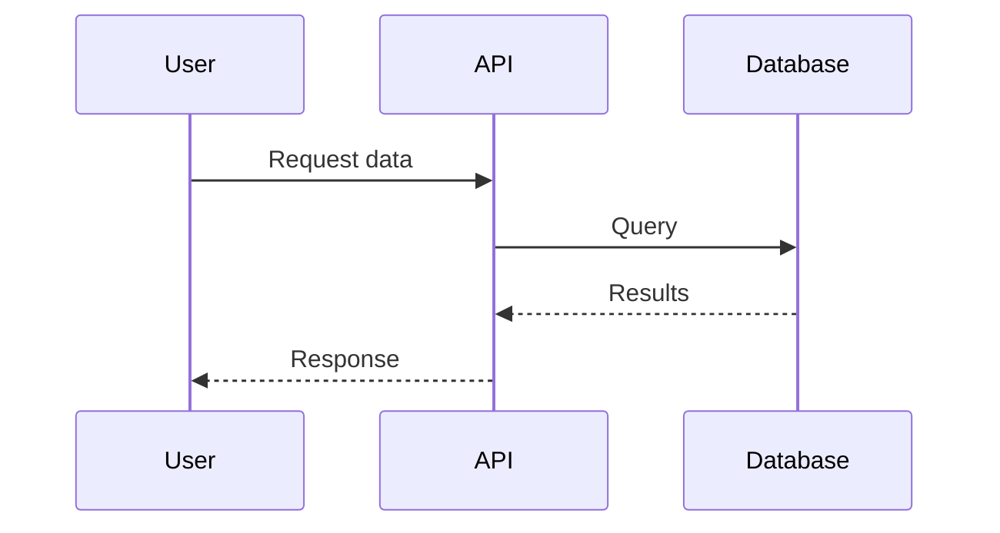
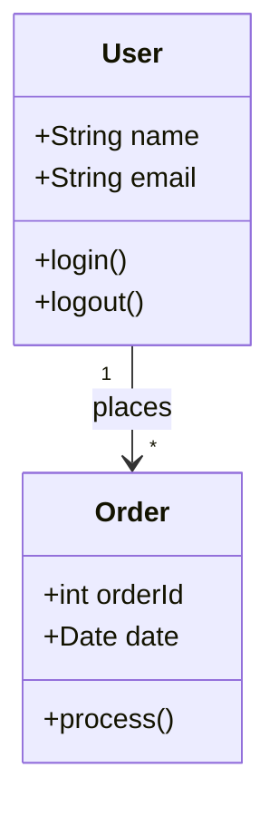
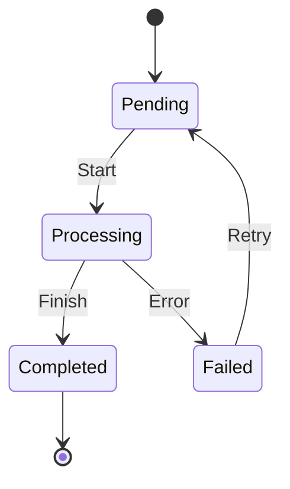
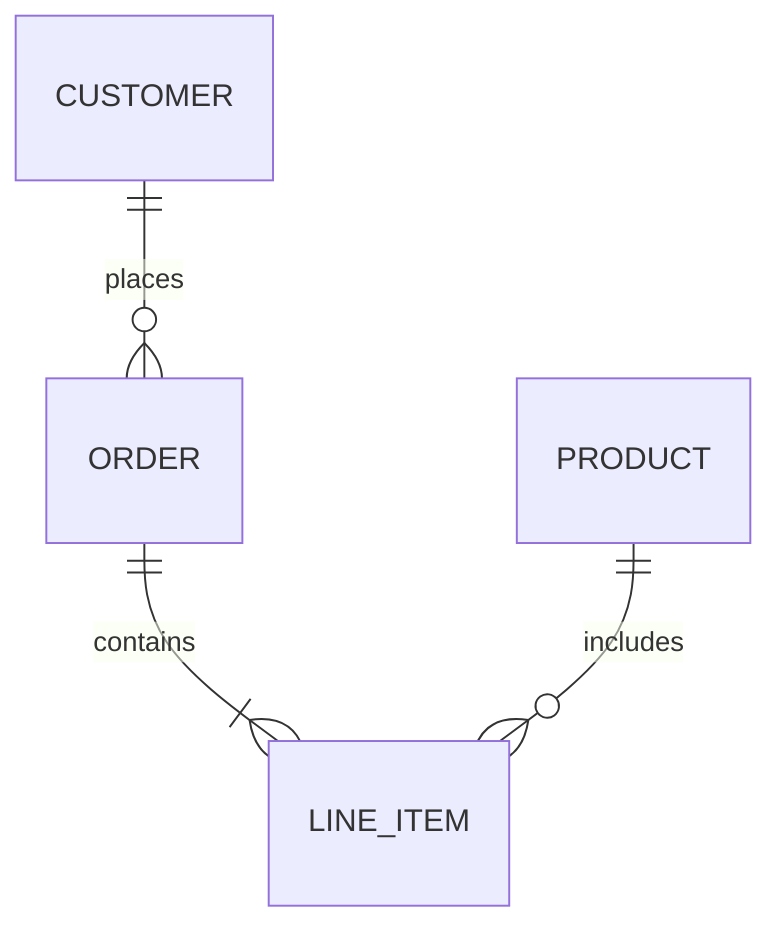
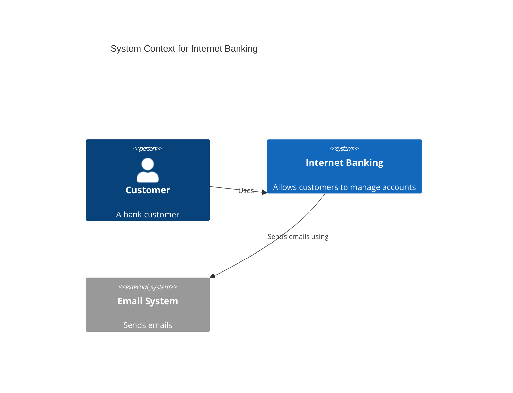

# DrawIO Diagram Creation

This skill enables creating professional diagrams from architecture concepts, business processes, and technical documentation. Transform abstract ideas into visual, user-friendly diagrams that can be used in any documentation.

## When to Use This Skill

Use this skill when asked to:
- Create **architecture diagrams** (cloud, software, system, network)
- Design **flowcharts** and **process flows** (BPMN, swimlanes, decision trees)
- Build **UML diagrams** (class, sequence, activity, state, component, deployment)
- Generate **cloud architecture diagrams** (AWS, Azure, GCP, IBM)
- Create **entity-relationship diagrams** (ERD) for database modeling
- Design **C4 model diagrams** (context, container, component, code)
- Build **network and infrastructure diagrams** (rack, topology)
- Create **org charts** and **hierarchical diagrams**
- Design **mind maps** and **concept maps**
- Generate **timelines**, **roadmaps**, and **Gantt charts**
- Create **infographics** and **visual documentation**

## Core Concepts

### DrawIO File Format

DrawIO uses an XML-based format with the `.drawio` extension. The structure consists of:

```xml
<mxfile host="..." modified="..." agent="..." version="...">
  <diagram id="..." name="Page-1">
    <mxGraphModel dx="..." dy="..." grid="1" gridSize="10" ...>
      <root>
        <mxCell id="0"/>
        <mxCell id="1" parent="0"/>
        <!-- Shapes and connectors go here -->
      </root>
    </mxGraphModel>
  </diagram>
</mxfile>
```

### Shape (mxCell) Structure

```xml
<!-- Vertex (shape) -->
<mxCell id="uniqueId" value="Label" style="styleString" 
        vertex="1" parent="1">
  <mxGeometry x="100" y="100" width="120" height="60" as="geometry"/>
</mxCell>

<!-- Edge (connector) -->
<mxCell id="edgeId" value="Label" style="edgeStyle=orthogonalEdgeStyle;..." 
        edge="1" parent="1" source="sourceId" target="targetId">
  <mxGeometry relative="1" as="geometry"/>
</mxCell>
```

## Diagram Generation Methods

### Method 1: Mermaid Syntax (Recommended for Quick Diagrams)

Mermaid provides a text-based way to create diagrams that DrawIO can import:

#### Flowchart



#### Sequence Diagram



#### Class Diagram



#### State Diagram



#### Entity Relationship



#### C4 Context



### Method 2: DrawIO XML Generation

For complex diagrams, generate native DrawIO XML format.

See [references/xml-format.md](./references/xml-format.md) for complete XML specification.

## Common Diagram Patterns

### Architecture Diagram Pattern

```
┌─────────────────────────────────────────────────────┐
│                    Load Balancer                     │
└─────────────────────────────────────────────────────┘
                          │
         ┌────────────────┼────────────────┐
         ▼                ▼                ▼
    ┌─────────┐      ┌─────────┐      ┌─────────┐
    │ Server 1│      │ Server 2│      │ Server 3│
    └─────────┘      └─────────┘      └─────────┘
         │                │                │
         └────────────────┼────────────────┘
                          ▼
              ┌─────────────────────┐
              │      Database       │
              └─────────────────────┘
```

### Flowchart Pattern

```
     ┌─────────┐
     │  Start  │
     └────┬────┘
          │
     ┌────▼────┐
     │ Process │
     └────┬────┘
          │
     ┌────▼────┐
    ◇ Decision? ◇──No──▶ ...
     └────┬────┘
          │Yes
     ┌────▼────┐
     │  Action │
     └────┬────┘
          │
     ┌────▼────┐
     │   End   │
     └─────────┘
```

### Swimlane Pattern

```
┌──────────────┬──────────────┬──────────────┐
│   Customer   │    System    │   Backend    │
├──────────────┼──────────────┼──────────────┤
│  ┌───────┐   │              │              │
│  │Request│───┼────▶ ┌───┐   │              │
│  └───────┘   │      │API│───┼───▶ ┌────┐   │
│              │      └───┘   │     │ DB │   │
│              │              │     └────┘   │
└──────────────┴──────────────┴──────────────┘
```

## Shape Libraries

### General Shapes
- Rectangle, Rounded Rectangle, Ellipse, Diamond
- Cylinder (databases), Parallelogram (I/O)
- Triangle, Hexagon, Cloud shapes

### Cloud Provider Libraries
- **AWS**: EC2, S3, Lambda, RDS, VPC, CloudFront, API Gateway, etc.
- **Azure**: App Service, Functions, SQL, Storage, VNet, etc.
- **GCP**: Compute Engine, Cloud Functions, BigQuery, etc.

### UML Libraries
- Class boxes, Interface lollipops
- Actor symbols, Use case ovals
- Lifelines, Activation boxes
- Component boxes, Deployment nodes

### Network Libraries
- Routers, Switches, Firewalls
- Servers, Workstations, Mobile devices
- Cloud symbols, Database symbols

## Style Reference

### Common Styles

| Element | Style String |
|---------|--------------|
| Rectangle | `rounded=0;whiteSpace=wrap;html=1;` |
| Rounded | `rounded=1;whiteSpace=wrap;html=1;` |
| Ellipse | `ellipse;whiteSpace=wrap;html=1;` |
| Diamond | `rhombus;whiteSpace=wrap;html=1;` |
| Cylinder | `shape=cylinder3;whiteSpace=wrap;html=1;` |
| Cloud | `ellipse;shape=cloud;whiteSpace=wrap;html=1;` |
| Arrow | `edgeStyle=orthogonalEdgeStyle;rounded=0;` |
| Dashed | `dashed=1;` |

### Color Reference

| Color | Hex Code |
|-------|----------|
| Blue (primary) | `#1976D2` |
| Green (success) | `#388E3C` |
| Orange (warning) | `#F57C00` |
| Red (error) | `#D32F2F` |
| Gray (neutral) | `#757575` |
| AWS Orange | `#FF9900` |
| Azure Blue | `#0089D6` |
| GCP Blue | `#4285F4` |

## Workflow: Creating a Diagram

### Step 1: Understand Requirements

Before creating, clarify:
1. **Type**: What kind of diagram? (architecture, flow, UML, etc.)
2. **Scope**: What should be included/excluded?
3. **Audience**: Technical vs. business stakeholders?
4. **Detail Level**: High-level overview or detailed specification?

### Step 2: Choose Generation Method

| Scenario | Recommended Method |
|----------|-------------------|
| Quick flowchart/sequence | Mermaid syntax |
| Complex architecture | DrawIO XML |
| Cloud infrastructure | DrawIO with cloud shapes |
| UML class diagrams | Mermaid or DrawIO |
| Database ERD | Mermaid erDiagram |
| C4 models | Mermaid C4Context |

### Step 3: Generate Diagram Content

For Mermaid:
1. Write the Mermaid syntax
2. Provide instructions to insert via: `Arrange > Insert > Mermaid`

For DrawIO XML:
1. Create the mxfile structure
2. Add mxCell elements for shapes
3. Add mxCell elements for connectors
4. Save as `.drawio` file

### Step 4: Output the Diagram

Provide the user with:
1. The diagram code (Mermaid or XML)
2. Instructions to open/import in DrawIO
3. Suggestions for styling and refinement

## Guidelines

### Do
- Use consistent shape sizes and spacing
- Align shapes to a grid (default 10px)
- Use clear, concise labels
- Group related elements visually
- Use color meaningfully (not decoratively)
- Include a legend when using symbols
- Use layers for complex diagrams
- Maintain visual hierarchy

### Avoid
- Overcrowding with too many elements
- Crossing connector lines when possible
- Inconsistent styling within a diagram
- Ambiguous flow directions
- Tiny, unreadable text
- More than 5-7 colors per diagram
- Orphaned elements (disconnected shapes)

## Export Formats

DrawIO supports exporting to:
- **PNG/JPEG**: Raster images for documentation
- **SVG**: Vector graphics for web/scaling
- **PDF**: Print-ready documents
- **HTML**: Interactive web embedding
- **XML**: Native editable format
- **VSDX**: Microsoft Visio compatibility

## References

- [XML Format Reference](./references/xml-format.md) - Complete DrawIO XML specification
- [Mermaid Syntax Guide](./references/mermaid-guide.md) - Detailed Mermaid syntax
- [Cloud Shapes Reference](./references/cloud-shapes.md) - AWS, Azure, GCP shape names
- [Example Diagrams](./references/examples.md) - Ready-to-use diagram templates

## Troubleshooting

| Issue | Solution |
|-------|----------|
| Shapes not connecting | Ensure source/target IDs are correct |
| Layout looks cramped | Increase spacing, use larger canvas |
| Connectors crossing | Adjust positions or use waypoints |
| Text cut off | Increase shape dimensions |
| Colors look wrong | Verify hex codes include # prefix |
| Import fails | Validate XML structure is complete |
