# DrawIO Diagram Examples

This document provides ready-to-use diagram templates and examples for common use cases.

## Basic Flowchart

### Mermaid Version

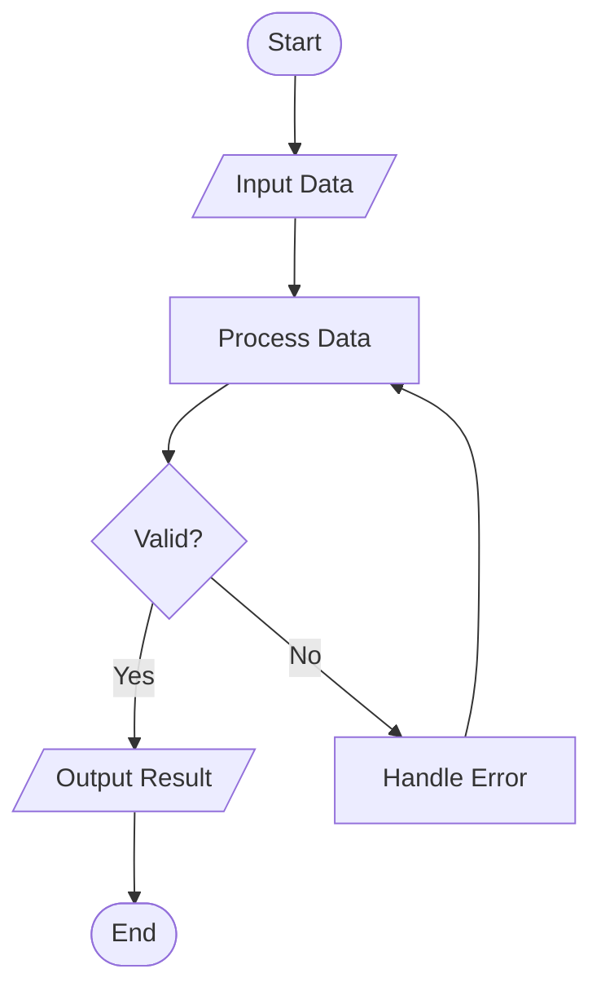

### DrawIO XML Version

```xml
<?xml version="1.0" encoding="UTF-8"?>
<mxfile host="app.diagrams.net">
  <diagram id="flowchart" name="Basic Flowchart">
    <mxGraphModel dx="0" dy="0" grid="1" gridSize="10">
      <root>
        <mxCell id="0"/>
        <mxCell id="1" parent="0"/>
        <mxCell id="start" value="Start" style="ellipse;whiteSpace=wrap;html=1;fillColor=#d5e8d4;strokeColor=#82b366;" vertex="1" parent="1">
          <mxGeometry x="160" y="40" width="80" height="40" as="geometry"/>
        </mxCell>
        <mxCell id="input" value="Input Data" style="shape=parallelogram;perimeter=parallelogramPerimeter;whiteSpace=wrap;html=1;fillColor=#dae8fc;strokeColor=#6c8ebf;" vertex="1" parent="1">
          <mxGeometry x="140" y="120" width="120" height="50" as="geometry"/>
        </mxCell>
        <mxCell id="process" value="Process Data" style="rounded=1;whiteSpace=wrap;html=1;fillColor=#dae8fc;strokeColor=#6c8ebf;" vertex="1" parent="1">
          <mxGeometry x="140" y="210" width="120" height="50" as="geometry"/>
        </mxCell>
        <mxCell id="decision" value="Valid?" style="rhombus;whiteSpace=wrap;html=1;fillColor=#fff2cc;strokeColor=#d6b656;" vertex="1" parent="1">
          <mxGeometry x="150" y="300" width="100" height="60" as="geometry"/>
        </mxCell>
        <mxCell id="output" value="Output Result" style="shape=parallelogram;perimeter=parallelogramPerimeter;whiteSpace=wrap;html=1;fillColor=#d5e8d4;strokeColor=#82b366;" vertex="1" parent="1">
          <mxGeometry x="40" y="400" width="120" height="50" as="geometry"/>
        </mxCell>
        <mxCell id="error" value="Handle Error" style="rounded=1;whiteSpace=wrap;html=1;fillColor=#f8cecc;strokeColor=#b85450;" vertex="1" parent="1">
          <mxGeometry x="240" y="400" width="120" height="50" as="geometry"/>
        </mxCell>
        <mxCell id="end" value="End" style="ellipse;whiteSpace=wrap;html=1;fillColor=#d5e8d4;strokeColor=#82b366;" vertex="1" parent="1">
          <mxGeometry x="60" y="500" width="80" height="40" as="geometry"/>
        </mxCell>
        <mxCell id="e1" style="edgeStyle=orthogonalEdgeStyle;" edge="1" parent="1" source="start" target="input"><mxGeometry relative="1" as="geometry"/></mxCell>
        <mxCell id="e2" style="edgeStyle=orthogonalEdgeStyle;" edge="1" parent="1" source="input" target="process"><mxGeometry relative="1" as="geometry"/></mxCell>
        <mxCell id="e3" style="edgeStyle=orthogonalEdgeStyle;" edge="1" parent="1" source="process" target="decision"><mxGeometry relative="1" as="geometry"/></mxCell>
        <mxCell id="e4" value="Yes" style="edgeStyle=orthogonalEdgeStyle;" edge="1" parent="1" source="decision" target="output"><mxGeometry relative="1" as="geometry"/></mxCell>
        <mxCell id="e5" value="No" style="edgeStyle=orthogonalEdgeStyle;" edge="1" parent="1" source="decision" target="error"><mxGeometry relative="1" as="geometry"/></mxCell>
        <mxCell id="e6" style="edgeStyle=orthogonalEdgeStyle;" edge="1" parent="1" source="error" target="process"><mxGeometry relative="1" as="geometry"/></mxCell>
        <mxCell id="e7" style="edgeStyle=orthogonalEdgeStyle;" edge="1" parent="1" source="output" target="end"><mxGeometry relative="1" as="geometry"/></mxCell>
      </root>
    </mxGraphModel>
  </diagram>
</mxfile>
```

## Web Application Architecture

### Mermaid Version

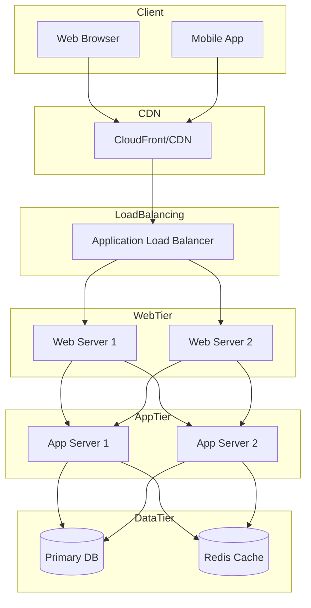

## Microservices Architecture

### Mermaid Version

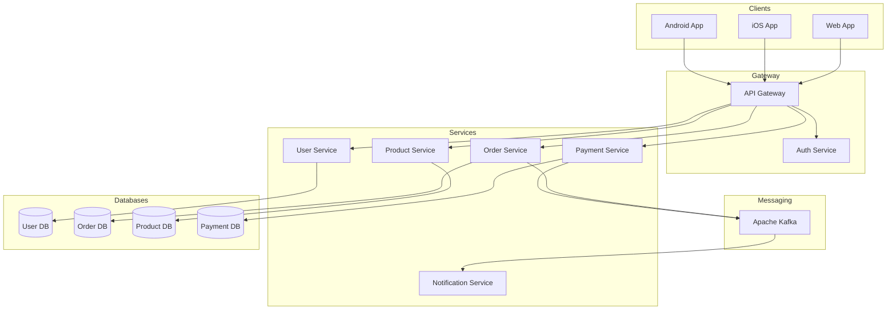

## Sequence Diagram - User Authentication

### Mermaid Version

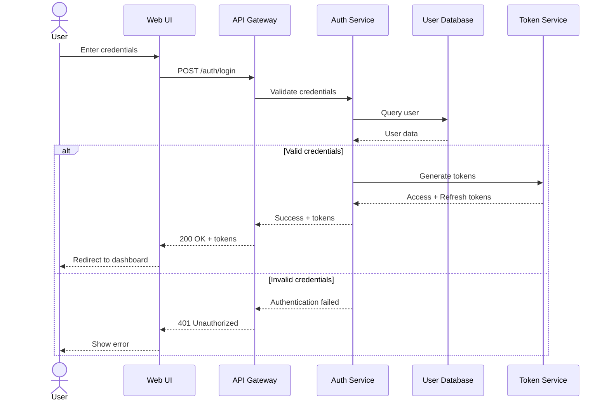

## Class Diagram - E-Commerce Domain

### Mermaid Version

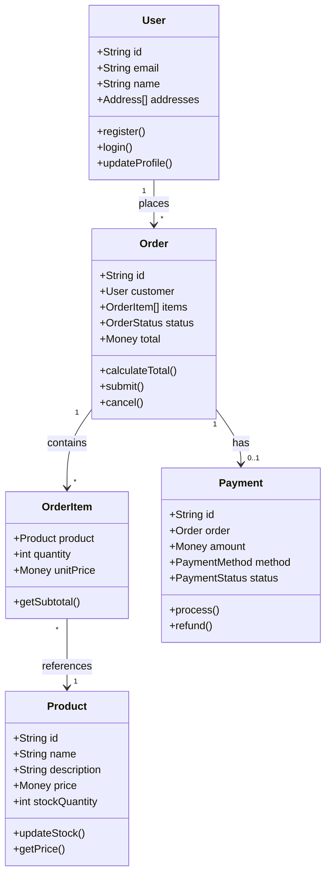

## State Diagram - Order Lifecycle

### Mermaid Version

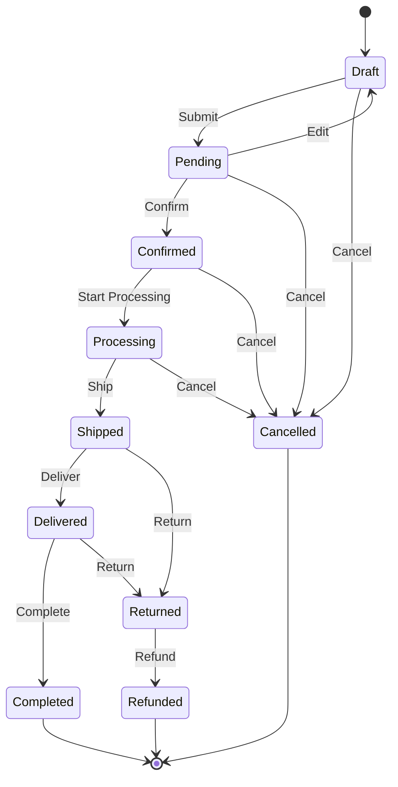

## Entity Relationship Diagram

### Mermaid Version

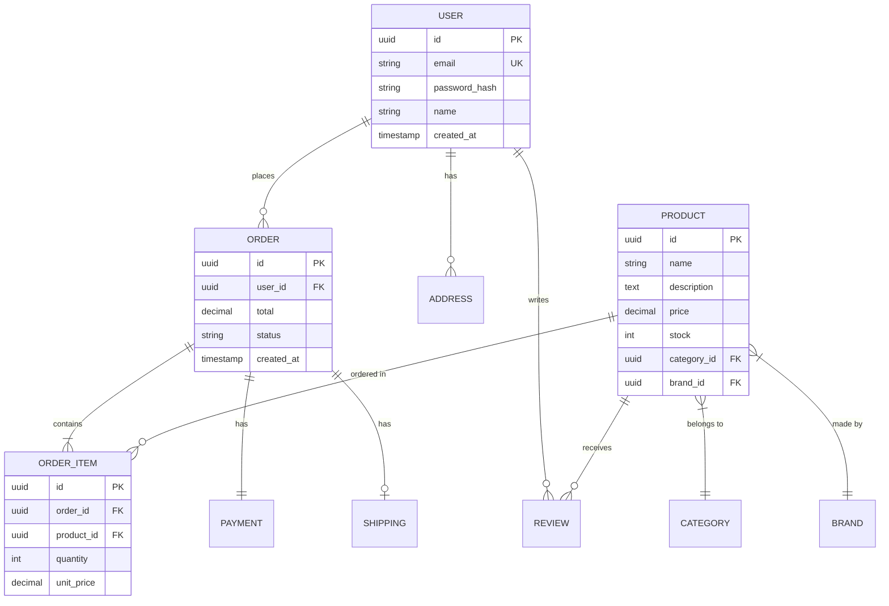

## C4 Context Diagram

### Mermaid Version

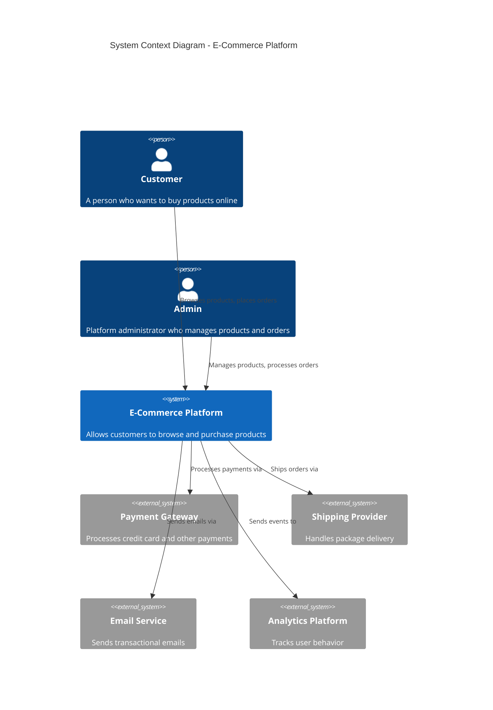

## Network Diagram

### Mermaid Version

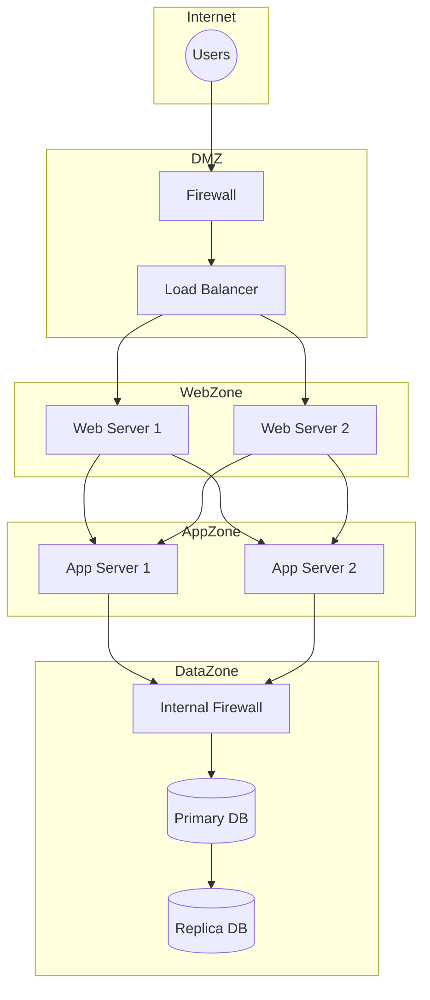

## CI/CD Pipeline

### Mermaid Version

```mermaid
graph LR
    subgraph Development
        Code[Code Commit]
    end
    
    subgraph CI
        Build[Build]
        UnitTest[Unit Tests]
        Lint[Linting]
        Security[Security Scan]
    end
    
    subgraph Artifacts
        Registry[(Container Registry)]
    end
    
    subgraph CD
        DeployDev[Deploy to Dev]
        IntTest[Integration Tests]
        DeployStaging[Deploy to Staging]
        E2ETest[E2E Tests]
        DeployProd[Deploy to Production]
    end
    
    Code --> Build
    Build --> UnitTest
    UnitTest --> Lint
    Lint --> Security
    Security --> Registry
    Registry --> DeployDev
    DeployDev --> IntTest
    IntTest --> DeployStaging
    DeployStaging --> E2ETest
    E2ETest --> DeployProd
```

## Deployment Diagram

### Mermaid Version

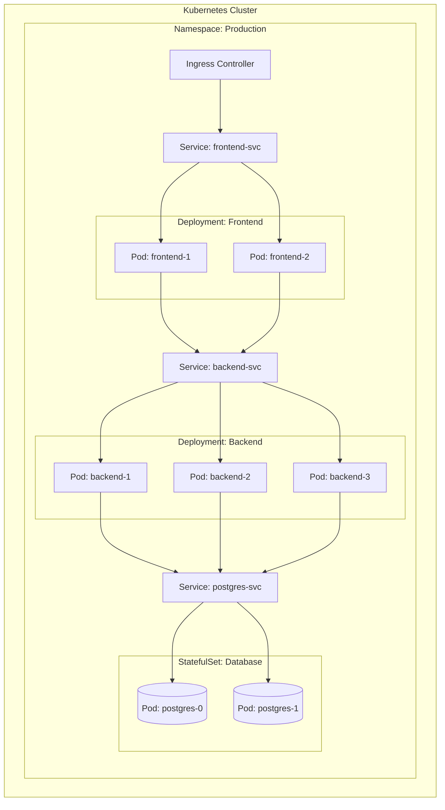

## Usage Instructions

### Using Mermaid Diagrams

1. Copy the Mermaid code block
2. Open DrawIO (app.diagrams.net)
3. Go to `Arrange > Insert > Mermaid`
4. Paste the code and click `Insert`
5. The diagram will be created as an editable group

### Using DrawIO XML

1. Copy the XML content
2. Save as a `.drawio` file
3. Open in DrawIO
4. Or paste into a new diagram using `File > Import From > Text`

### Customization Tips

- Change colors by modifying `fillColor` and `strokeColor` values
- Adjust sizes by changing `width` and `height` in geometry
- Reposition by changing `x` and `y` coordinates
- Add new shapes by copying existing `mxCell` elements and changing IDs
