# Mermaid Syntax Guide for DrawIO

Mermaid is a text-based diagramming syntax that DrawIO can import and render. This guide covers all supported diagram types.

## How to Use Mermaid in DrawIO

1. Open DrawIO (app.diagrams.net)
2. Go to: `Arrange > Insert > Mermaid`
3. Paste your Mermaid code
4. Click `Insert`

The diagram will be created as an editable shape group.

## Flowchart / Graph

### Basic Syntax

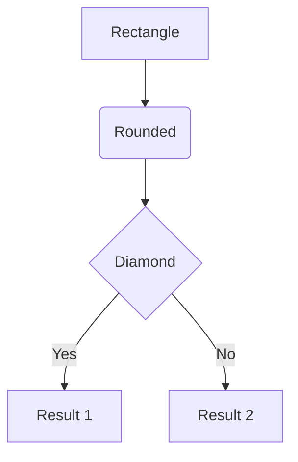

### Direction

| Code | Direction |
| --- | --- |
| `graph TD` | Top to Down |
| `graph TB` | Top to Bottom (same as TD) |
| `graph BT` | Bottom to Top |
| `graph LR` | Left to Right |
| `graph RL` | Right to Left |

### Node Shapes

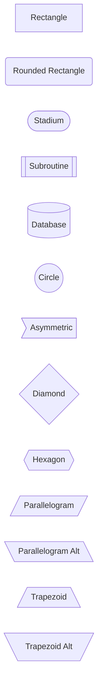

### Link Styles

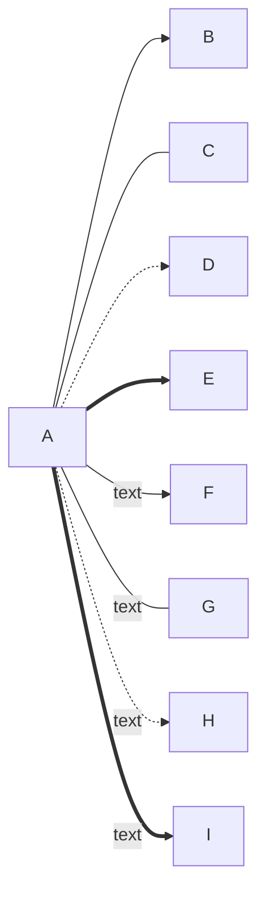

| Syntax | Result |
| --- | --- |
| `-->` | Arrow |
| `---` | Line (no arrow) |
| `-.->` | Dotted arrow |
| `==>` | Thick arrow |
| `--text-->` | Arrow with text |
| `-->|text|` | Arrow with text (alt) |

### Subgraphs

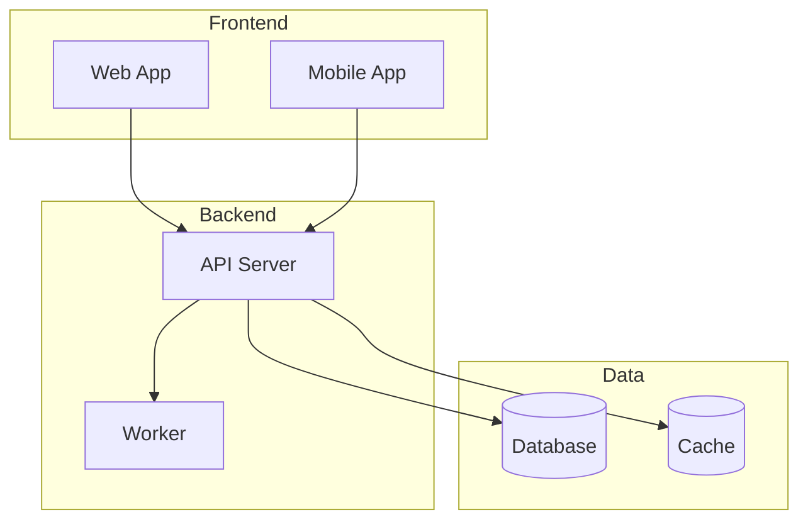

## Sequence Diagram

### Basic Syntax

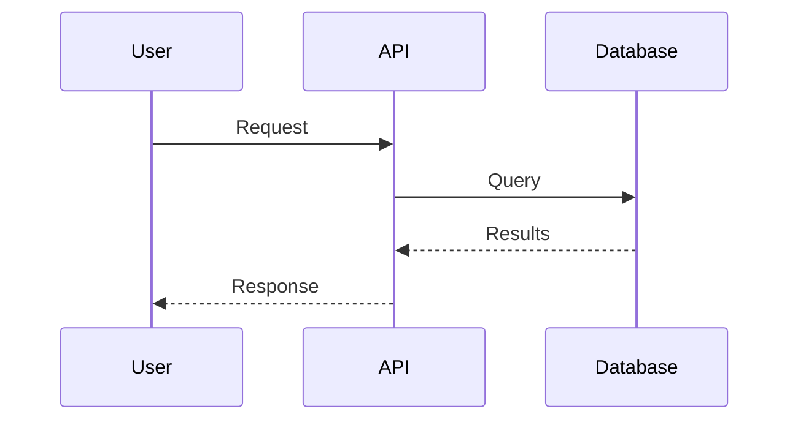

### Message Types

| Syntax | Description |
| --- | --- |
| `->` | Solid line |
| `-->` | Dotted line |
| `->>` | Solid with arrow |
| `-->>` | Dotted with arrow |
| `-x` | Solid with cross |
| `--x` | Dotted with cross |
| `-)` | Solid with open arrow |
| `--)` | Dotted with open arrow |

### Activations

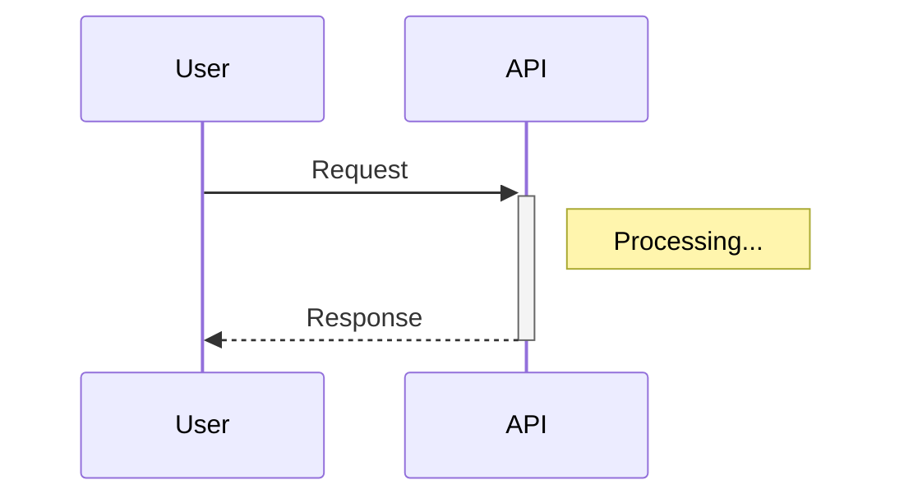

### Loops and Conditions

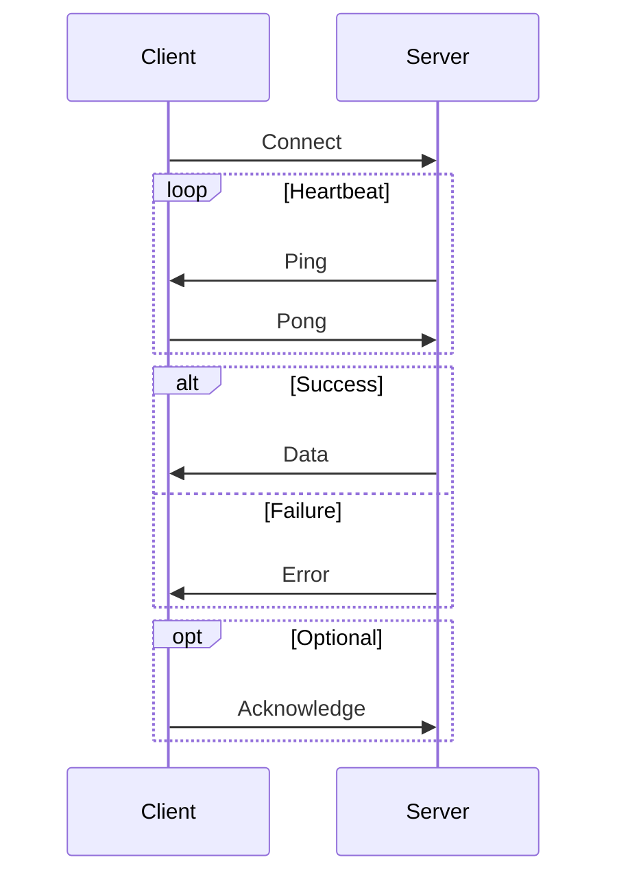

### Notes

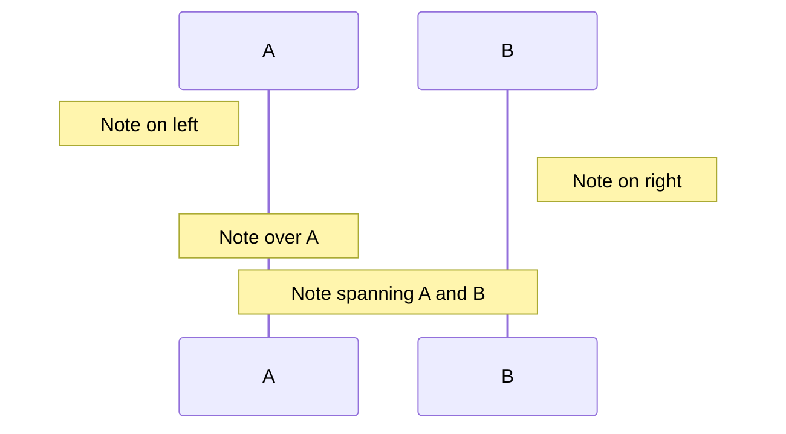

## Class Diagram

### Basic Syntax

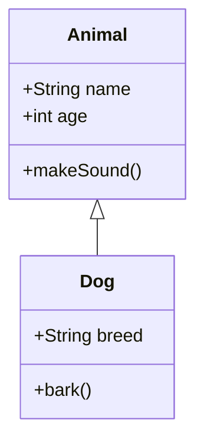

### Visibility Modifiers

| Symbol | Meaning |
| --- | --- |
| `+` | Public |
| `-` | Private |
| `#` | Protected |
| `~` | Package/Internal |

### Relationships

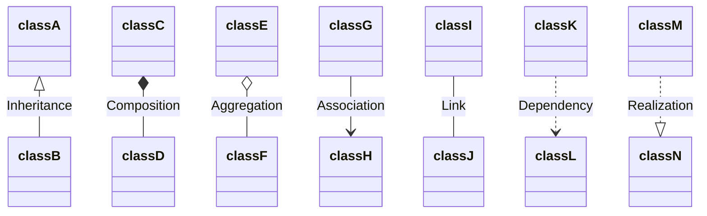

| Syntax | Type |
| --- | --- |
| `<\|--` | Inheritance |
| `*--` | Composition |
| `o--` | Aggregation |
| `-->` | Association |
| `--` | Link |
| `..>` | Dependency |
| `..\|>` | Realization |

### Cardinality

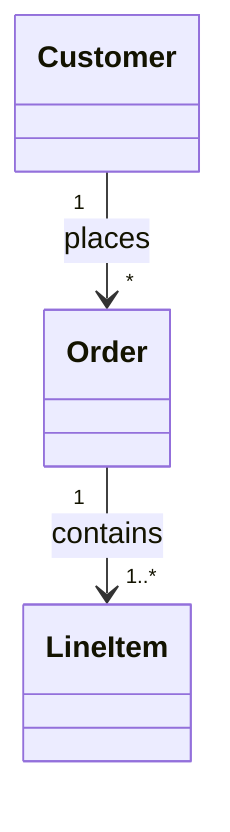

## State Diagram

### Basic Syntax

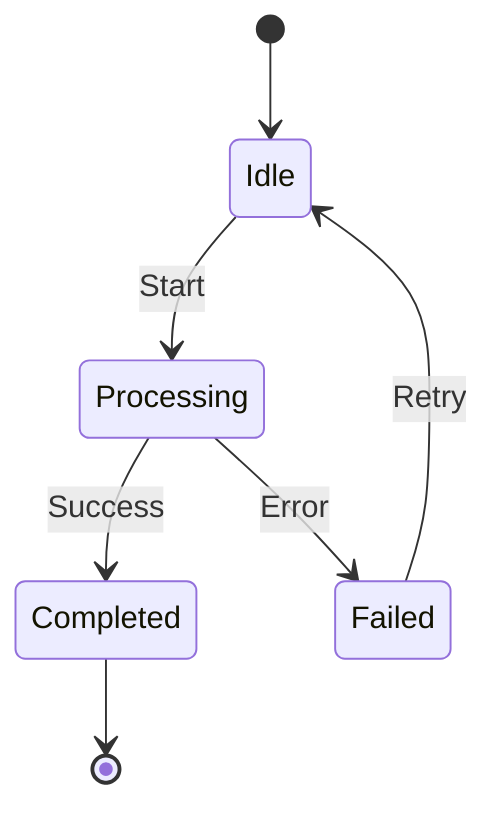

### Composite States

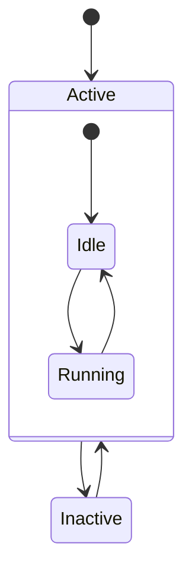

### Forks and Joins

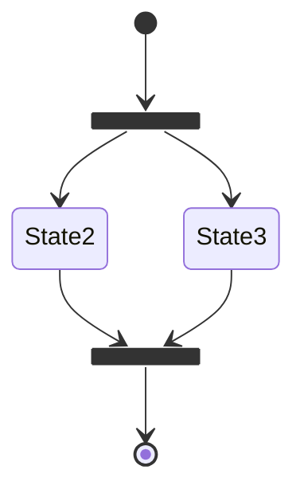

## Entity Relationship Diagram

### Basic Syntax

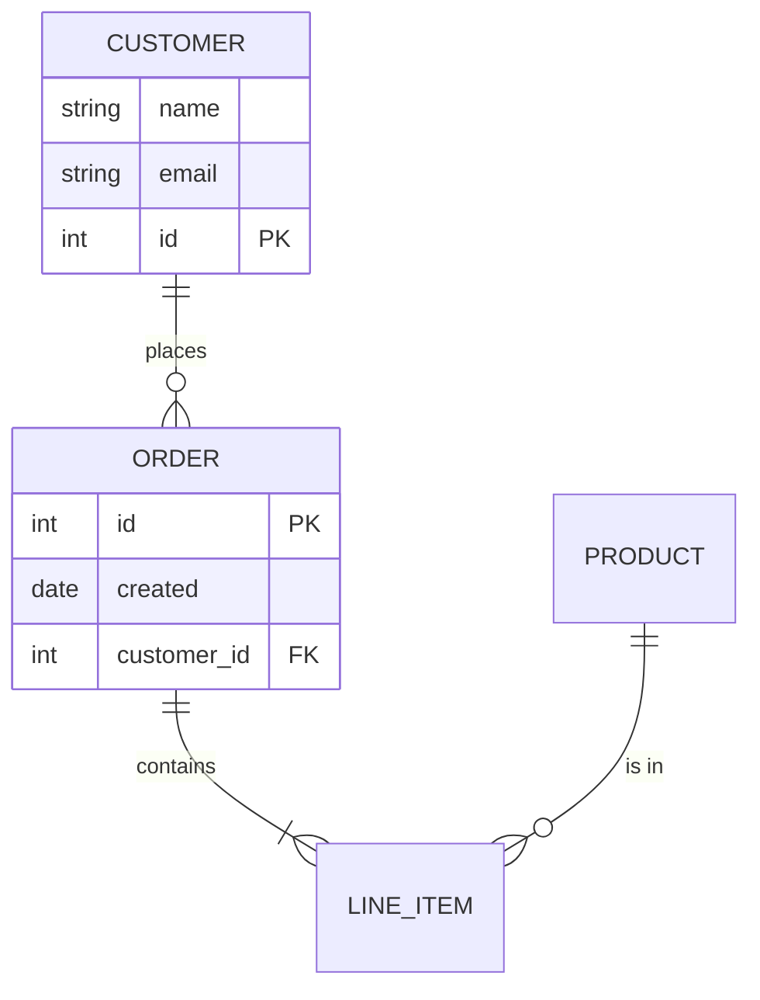

### Relationship Types

| Syntax | Meaning |
| --- | --- |
| `\|\|` | Exactly one |
| `o\|` | Zero or one |
| `}o` | Zero or more |
| `}\|` | One or more |

### Cardinality Combinations

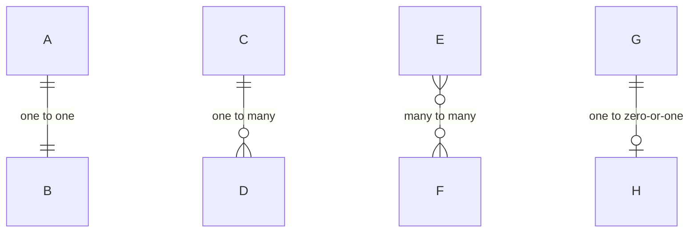

## C4 Diagrams

### Context Diagram

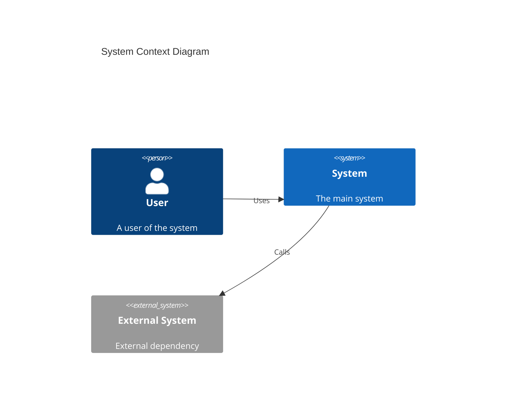

### Container Diagram

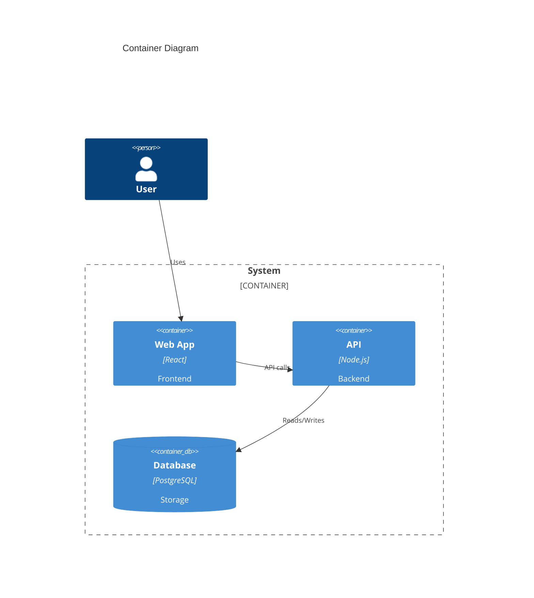

## Gantt Chart

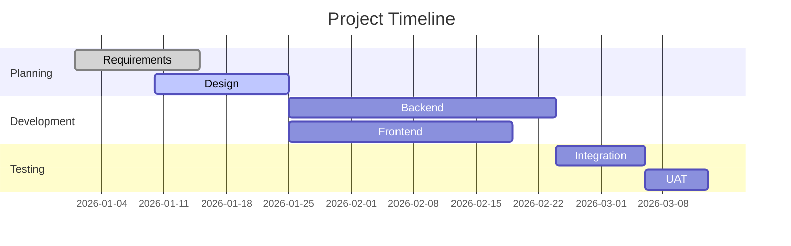

### Task States

| Keyword | Effect |
| --- | --- |
| `done` | Completed (gray) |
| `active` | In progress |
| `crit` | Critical path |
| `milestone` | Diamond marker |

## Pie Chart

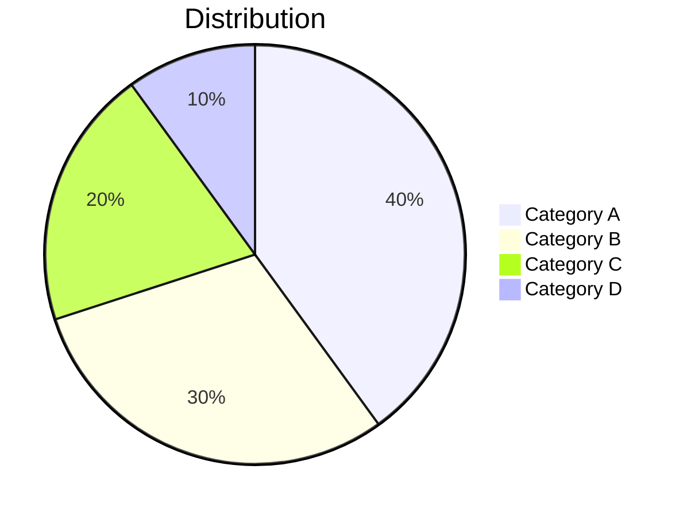

## Mindmap

```mermaid
mindmap
    root((Central Topic))
        Branch 1
            Leaf 1.1
            Leaf 1.2
        Branch 2
            Leaf 2.1
            Leaf 2.2
                Sub-leaf 2.2.1
        Branch 3
```

## Git Graph

```mermaid
gitGraph
    commit id: "Initial"
    branch develop
    checkout develop
    commit id: "Feature A"
    commit id: "Feature B"
    checkout main
    merge develop id: "Release 1.0"
    commit id: "Hotfix"
```

## Journey Diagram

```mermaid
journey
    title User Journey
    section Sign Up
        Visit site: 5: User
        Fill form: 3: User
        Verify email: 4: User
    section First Use
        Login: 5: User
        Complete tutorial: 4: User
        Create first item: 3: User
```

## Styling

### Node Styling

```mermaid
graph LR
    A:::highlight --> B
    B --> C:::warning
    
    classDef highlight fill:#f9f,stroke:#333,stroke-width:2px
    classDef warning fill:#ff0,stroke:#f00
```

### Link Styling

```mermaid
graph LR
    A --> B
    linkStyle 0 stroke:#ff0,stroke-width:4px
```

## Best Practices

1. **Keep it simple**: Start with basic diagrams, add detail as needed
2. **Use aliases**: `participant U as User` makes code more readable
3. **Add notes**: Use notes to explain complex interactions
4. **Group related items**: Use subgraphs for logical grouping
5. **Consistent direction**: Pick TD or LR and stick with it
6. **Meaningful IDs**: Use descriptive node IDs like `webServer` not `A`

## Common Patterns

### API Flow

```mermaid
sequenceDiagram
    participant C as Client
    participant LB as Load Balancer
    participant API as API Server
    participant DB as Database
    participant Cache as Redis
    
    C->>LB: Request
    LB->>API: Forward
    API->>Cache: Check cache
    alt Cache hit
        Cache-->>API: Cached data
    else Cache miss
        API->>DB: Query
        DB-->>API: Data
        API->>Cache: Store
    end
    API-->>LB: Response
    LB-->>C: Response
```

### Microservices

```mermaid
graph TB
    subgraph Frontend
        Web[Web App]
        Mobile[Mobile App]
    end
    
    subgraph Gateway
        API[API Gateway]
    end
    
    subgraph Services
        Auth[Auth Service]
        User[User Service]
        Order[Order Service]
        Payment[Payment Service]
    end
    
    subgraph Data
        AuthDB[(Auth DB)]
        UserDB[(User DB)]
        OrderDB[(Order DB)]
    end
    
    Web --> API
    Mobile --> API
    API --> Auth
    API --> User
    API --> Order
    API --> Payment
    Auth --> AuthDB
    User --> UserDB
    Order --> OrderDB
```

### State Machine

```mermaid
stateDiagram-v2
    [*] --> Draft
    Draft --> Pending : Submit
    Pending --> Approved : Approve
    Pending --> Rejected : Reject
    Rejected --> Draft : Revise
    Approved --> Published : Publish
    Published --> Archived : Archive
    Archived --> [*]
```
