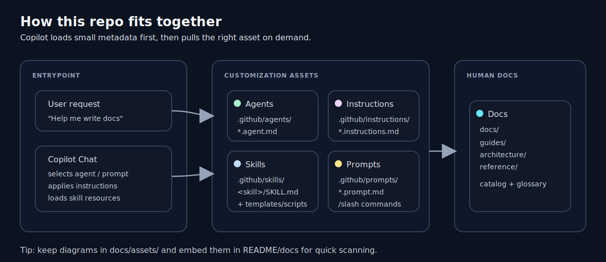
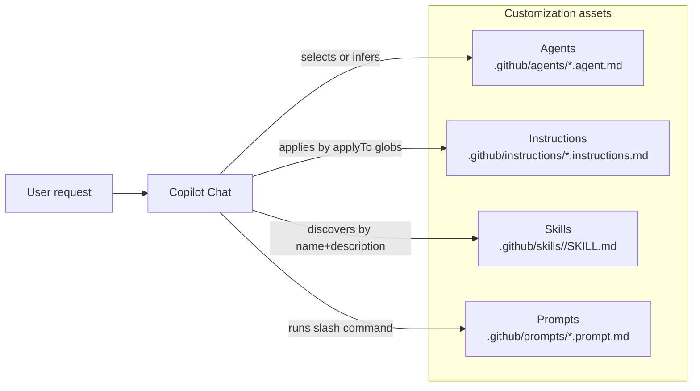

# Copilot Resources

A curated library of **GitHub Copilot customization assets** (agents, skills, prompts, and instruction files) designed to be reusable across projects.

If you want Copilot to behave more like a teammate with strong opinions—this repo is the toolbox.

## What’s in this repo

- **Agents**: role definitions with tool access and operating rules
- **Skills**: progressively-loaded task toolkits (docs, scripts, templates)
- **Prompt files**: reusable slash commands (structured playbooks)
- **Instruction files**: authoring rules and quality bars

Primary documentation lives in [docs/README.md](docs/README.md).

## Quick start

1. Browse the catalog: [docs/reference/catalog.md](docs/reference/catalog.md)
2. Pick an agent or skill you want to try.
3. Integrate using one of the options below:

### Integration options

- **Shared library (recommended)**: keep this repo as the source of truth and copy/sync assets into other repos as needed.
- **Vendor into a repo**: copy `.github/agents/`, `.github/skills/`, `.github/prompts/`, `.github/instructions/` into the target repository.
- **Personal (user-wide) skills**: install skills into `~/.github/skills/<skill-name>/` (see the skill guidelines for supported locations).

More detail: [docs/guides/getting-started.md](docs/guides/getting-started.md)

## How the pieces fit together

## Visual overview

More detail: [docs/architecture/agent-workflow.md](docs/architecture/agent-workflow.md)

Full explanation: [docs/architecture/copilot-customization-model.md](docs/architecture/copilot-customization-model.md)

## Repository layout

| Path | What it contains |
| --- | --- |
| [.github/agents/](.github/agents/) | Custom agent definitions (`*.agent.md`) |
| [.github/skills/](.github/skills/) | Skill packs (each folder contains a `SKILL.md`) |
| [.github/prompts/](.github/prompts/) | Prompt files (`*.prompt.md`) |
| [.github/instructions/](.github/instructions/) | Authoring rules / quality bars (`*.instructions.md`) |
| [docs/](docs/) | Project documentation (guides, architecture, reference) |

## Authoring & extending

If you’re adding new assets, start with the repo’s authoring rules:

- Agents: [.github/instructions/agents.instructions.md](.github/instructions/agents.instructions.md)
- Skills: [.github/instructions/agent-skills.instructions.md](.github/instructions/agent-skills.instructions.md)
- Prompts: [.github/instructions/prompt.instructions.md](.github/instructions/prompt.instructions.md)
- Instructions: [.github/instructions/instructions.instructions.md](.github/instructions/instructions.instructions.md)

Contributor-friendly overview: [docs/guides/authoring.md](docs/guides/authoring.md)

## License

See [LICENSE](LICENSE).
