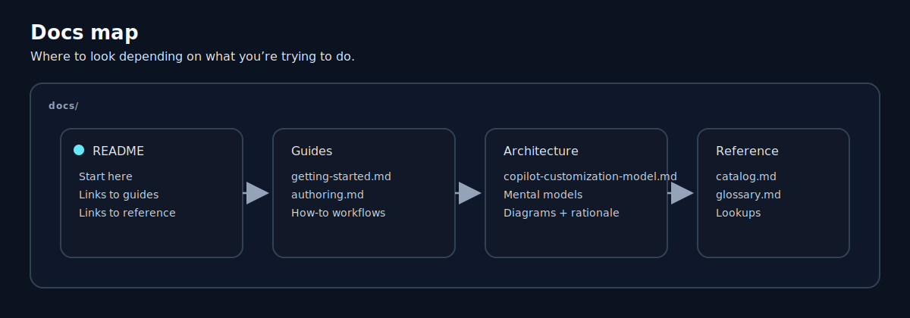

# Documentation

This folder contains the “primary docs” for **copilot-resources**: what it is, how to use it, and how to extend it.

## Start here

- [Getting started](guides/getting-started.md)
- [How the pieces fit together](architecture/copilot-customization-model.md)
- [Agent workflow map (handoffs)](architecture/agent-workflow.md)

## Reference

- [Catalog (agents, skills, prompts, instructions)](reference/catalog.md)
- [Glossary](reference/glossary.md)
