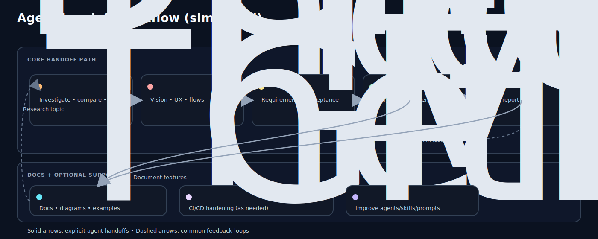

# Agent Workflow Map

This page captures a pragmatic way to **compose Copilot agents** across a software development workflow, using a simplified handoff-first model.

It’s not meant to be prescriptive. Think of it as:

- a **handoff cheat sheet** (who to pull in next)
- a way to keep conversations **high-signal** (each agent stays in its lane)

## Visual map

## Typical flow (high level)

1. **Research**: use **The Researcher** to gather facts, tradeoffs, and references.
2. **Design**: use **The Product Designer** to turn insights into product vision, UX, and user journeys.
3. **Requirements**: use **Technical Product Manager** to turn needs into requirements and acceptance criteria.
4. **Implementation**: use **Full Stack Engineer** to ship changes (verify-first).
5. **QA**: use **QA Frontend Tester** to validate behavior and capture actionable findings.
6. **Docs**: use **The Documenter** to make the outcome understandable and maintainable.

### Optional support

- Use **GitHub Actions Expert** when you need CI/CD design, hardening, or release automation.

### What the arrows mean in the diagram

- **Solid arrows**: explicit agent-to-agent handoffs defined in the agents’ frontmatter `handoffs`.
- **Dashed arrows**: common feedback loops you’ll see in practice.

## Feedback loops (where the workflow is intentionally non-linear)

- QA findings often loop back to implementation.
- Implementation realities often loop back to requirements.
- Research can be pulled in at any time when uncertainty is high.
- Design often loops with research and requirements until the shape of the solution is clear.

## When to pull in Metaprompter

Use **Metaprompter** when you want to _improve the system itself_:

- create or refine an agent
- author a new skill
- add a prompt file for a repeatable workflow
- create instruction files that enforce consistency

## Quick links

- Catalog of agents: [../reference/catalog.md](../reference/catalog.md)
- How customization artifacts fit together: [copilot-customization-model.md](copilot-customization-model.md)
