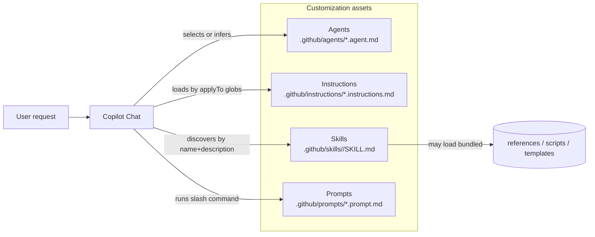

# Copilot Customization Model

This repository organizes Copilot customization into four artifact types.

## Mental model

## What each artifact is for

### Agents

Agents define a *role* with:

- an identity (what the agent is “good at”)
- operating rules (constraints, verification discipline)
- tool access
- optional handoffs for guided workflows

### Instructions

Instruction files set **quality bars and conventions** and are applied via glob patterns.

Use instructions for things like:

- “How should we structure new prompt files?”
- “What must every skill include?”
- “What naming conventions do we follow?”

### Skills

Skills are **progressively-loaded toolkits**.

A skill can include:

- `SKILL.md` instructions
- `references/` for deeper docs
- `templates/` for modifiable scaffolds
- `assets/` for static files to copy/use as-is
- `scripts/` for automation

### Prompt files

Prompt files define reusable slash commands (like a mini playbook) that can:

- gather required inputs
- execute a repeatable workflow
- produce consistent output with QA steps

## Progressive loading (why skills scale)

Skills support a three-level loading model:

1. **Discovery**: only `name` + `description` are scanned
2. **Instructions**: `SKILL.md` body loads when relevant
3. **Resources**: supporting files load only when referenced

This makes it practical to install many skills without bloating context.
